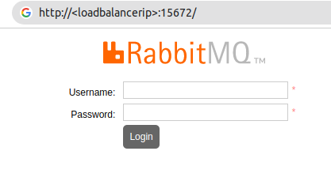
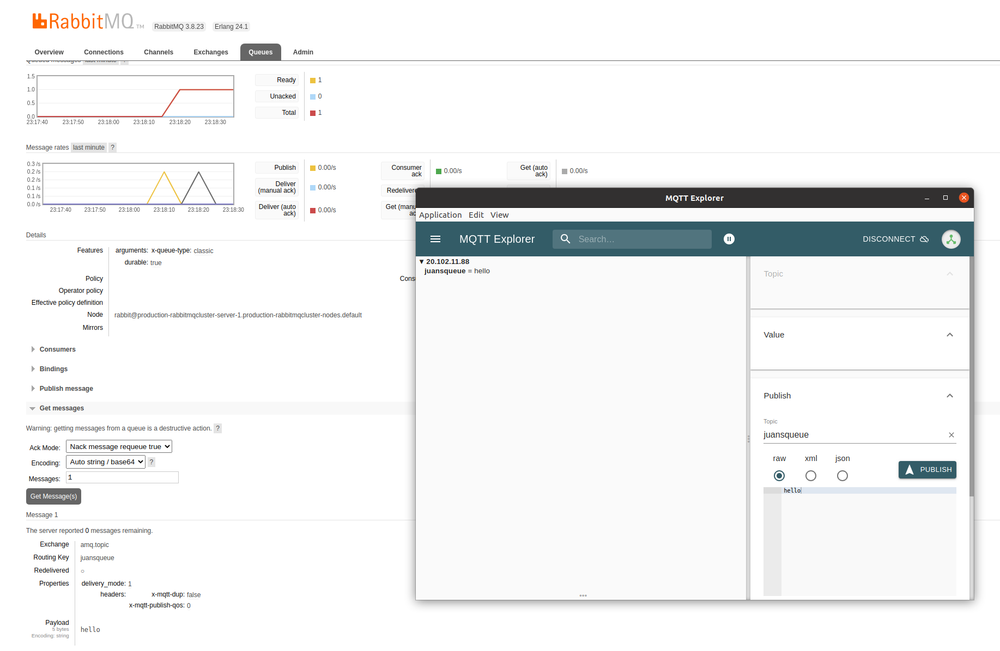
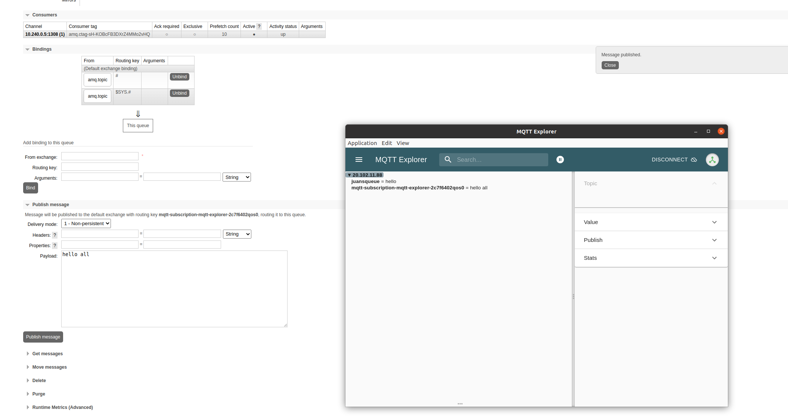

# Rabbitmq controller in AKS configuring MQTT

## Create AKS and configure helm

### Creating AKS with default

```bash
export RESOURCE_GROUP=aks-resource-group
export LOCATION=eastus
export AKS_NAME=aks-cluster

az login

az group create --name $RESOURCE_GROUP --location $LOCATION
az aks create --name $AKS_NAME --resource-group $RESOURCE_GROUP --node-count 3 --generate-ssh-keys
az aks get-credentials --name $AKS_NAME --resource-group $RESOURCE_GROUP
```

### Install HELM (bye bye Tiller)

```bash

curl https://raw.githubusercontent.com/kubernetes/helm/master/scripts/get-helm-3 > get_helm.sh
chmod 700 get_helm.sh
./get_helm.sh
rm ./get_helm.sh

```

### Add Azure-Marketplace helm repo

```bash
helm repo add azure-marketplace https://marketplace.azurecr.io/helm/v1/repo
helm install my-release azure-marketplace/rabbitmq-cluster-operator
```

## Deploy rabbitmq cluster

### Cluster with mqtt

Keep in mind this is a basic configuration and it is **not secure**. It is only for demo purposes.

```bash
kubectl apply -f cluster.yaml
```

```yaml
apiVersion: rabbitmq.com/v1beta1
kind: RabbitmqCluster
metadata:
  name: production-rabbitmqcluster
spec:
  replicas: 3
  resources:
    requests:
      cpu: 500m
      memory: 1Gi
    limits:
      cpu: 1
      memory: 2Gi
  rabbitmq:
    additionalConfig: |
      log.console.level = info
      channel_max = 1700
      loopback_users = none
      default_user= guest 
      default_pass = guest
      default_user_tags.administrator = true # -> gives access to guest from external IPs, by default only localhost
    additionalPlugins:
      - rabbitmq_mqtt # -> install mqtt plugin
  service:
    type: LoadBalancer
```

You can also check the default schema of the operator [here](./template.yaml)

### Some useful commands

```bash

# describe the deployed cluster
kubectl describe RabbitmqCluster production-rabbitmqcluster 

# List all the resources deployed with rabbitmq
kubectl get all -l app.kubernetes.io/part-of=rabbitmq

# Describe the configured services
kubectl exec production-rabbitmqcluster-server-0 -- /bin/sh -c "rabbitmqctl cluster_status --formatter json" | jq

# Public IP from the loadBalancer
kubectl get svc production-rabbitmqcluster -o jsonpath='{.status.loadBalancer.ingress[0].ip}'

```

Now that you have the load balancer IP, visit the endpoint in port 15672.



Also, you can use the [mqtt-explorer](http://mqtt-explorer.com/) to send and receive messages.




